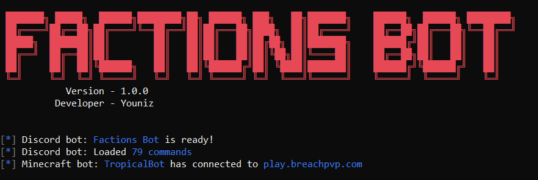

# 🚀 Minecraft Factions Discord Bot

####  📔 Table Of Contents:
* [Features](https://github.com/Youniz/Minecraft-Factions-Bot/blob/main/docs/features.md)
* [Commands  List](https://github.com/Youniz/Minecraft-Factions-Bot/blob/main/docs/commands.md)
* [Installation-Guide](https://github.com/Youniz/Minecraft-Factions-Bot/blob/main/docs/installation-guide.md)
* [FAQ](https://github.com/Youniz/Minecraft-Factions-Bot/blob/main/docs/faq.md)

#### 🛠️ TO DO:
* Add deposits/withdraw tracking of faction players
* Add more moderation commands

#### ❤️ Support:
* You can contact me on discord: `Youniz#6267`
* Join my support server: [Discord](https://discord.gg/aSQsaB4t43)

#### 🌟 Credits:
* Brashive

#### 📝 License
This project is [MIT](https://github.com/Koolwiza/Bot-12/blob/master/LICENSE) licensed.
