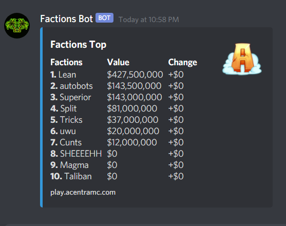

# Factions Bot Features

* Ingame commands (tps, checked, bchecked, weewoo, ect.)
* Ftop/flist/back tracking
* General factions commands (ftop, flist, fshow, tps, ect.)
* Application system (apply, accept, deny, ect.)
* Moderation commands (kick, ban, mute, purge, etc.)
* Fun commands (8ball, slapp, kiss, etc.)
* Music bot included

### Ftop

### Flist

### Wall Checks

### Buffer Checks

### Player Stats

### Applications
\

### Ingame Verification

### WeeWoo

### DM Announcements

### Settings

